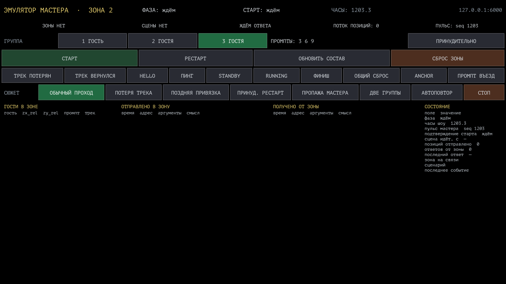

# Эмулятор мастера — микро-проект для разработчика зоны

`zone_dev_kit.toe` притворяется мастером инсталляции: шлёт в вашу зону ровно те же OSC-сообщения, что придут на площадке, и показывает, чем зона отвечает. Ни настоящего мастера, ни BlackTrax, ни сети площадки для работы не нужно — достаточно TouchDesigner и вашего проекта.

TouchDesigner **2025.33070**.

---

## Запуск за минуту

1. Откройте `zone_dev_kit.toe`.
2. На компоненте `dev_kit`, страница пар **Связь**:
   - `Zone` — номер вашей зоны (адреса станут `/zoneN/...`);
   - `Zoneip` — IP компа зоны; `127.0.0.1`, если ваш проект открыт на этой же машине;
   - `Zoneport` — **6000**, порт, который слушает зона;
   - `Listenport` — **6002**, сюда зона отвечает мастеру.
3. Откройте панель: правый клик на `ui` → **Open as Window** (или пульс `winopen` на `ui_window`).
4. Нажмите **СТАРТ**.

Если ваша зона отвечает `/zoneN/session/start`, лампочка станет «СТАРТ ПОДТВЕРЖДЁН» и сразу пойдёт поток позиций — гости поедут через зону. Если не отвечает, эмулятор трижды повторит старт и зажжёт «ЗОНА НЕ ОТВЕТИЛА»: ровно так поведёт себя настоящий мастер.

> Порт 6002 занят? Значит, на этой же машине уже работает настоящий мастер. Поставьте `Listenport` любой свободный и укажите тот же порт в своей зоне как порт мастера.

---

## Панель

**Шапка и лампочки** — фаза, подтверждение старта, часы шоу, пульс, есть ли связь с зоной.

**ГРУППА** — сколько гостей и с какими промптами стартовать. Промпты правятся на странице пар «Группа» (`Prompt1/2/3`). Тумблер **ПРИНУДИТЕЛЬНО** — это флаг `force` в командах.

**Команды** — каждая кнопка шлёт ровно одно сообщение контракта:

| Кнопка | Сообщение |
|---|---|
| СТАРТ | `/zoneN/start guestCount p1 p2 p3 force` |
| РЕСТАРТ | `/zoneN/restart guestCount p1 p2 p3 force` |
| ОБНОВИТЬ СОСТАВ | `/zoneN/update guestCount p1 p2 p3` |
| СБРОС ЗОНЫ | `/zoneN/reset 1 force` |
| ТРЕК ПОТЕРЯН / ВЕРНУЛСЯ | `/zoneN/guest/<idx>/state 0` / `1` |
| ANCHOR | `/zoneN/anchor guestCount t1 t2 t3` |
| ПРОМПТ ВЪЕЗД | `/zoneN/prompt/enter uuid guest y_rel` |
| HELLO / ПИНГ / ФИНИШ / ОБЩИЙ СБРОС | `/show/hello`, `/show/ping`, `/show/finish`, `/show/reset` |
| STANDBY / RUNNING | `/show/state standby` / `running` |

Фоном всё время идёт `/show/heartbeat` 1 Гц (общих часов `/show/clock` больше нет), а во время сцены — `/zoneN/guest/<idx>/pos` 30 Гц и `/zoneN/time` 1 Гц; `/zoneN/count` — событие, уходит когда число гостей в зоне изменилось. Любой из них выключается на странице пар «Потоки».

**СЮЖЕТ** — прогон целиком, с движением гостей:

| Сценарий | Что проверяет |
|---|---|
| ОБЫЧНЫЙ ПРОХОД | базовый случай: старт, проход, финиш |
| ПОТЕРЯ ТРЕКА | посреди прохода у гостя 2 пропадает трек и через пару секунд возвращается |
| ПОЗДНЯЯ ПРИВЯЗКА | сцена началась на 2 гостей, потом приходит `update` на 3 — **без рестарта** |
| ПРИНУД. РЕСТАРТ | посреди сцены прилетает `restart` с `force=1` |
| ПРОПАЖА МАСТЕРА | пульс замолкает на 8 секунд, потом приходит `hello` |
| ДВЕ ГРУППЫ | сразу за первой группой заходит вторая с другими промптами |

**АВТОПОВТОР** гоняет проход по кругу: удобно оставить на ночь и посмотреть, не течёт ли сцена. **СТОП** всё останавливает.

Внизу — четыре колонки: гости прохода, что ушло в зону, что пришло от зоны, состояние.

---

## Что зона обязана делать

Минимум, без которого мастер считает зону упавшей:

- слушать UDP **6000**;
- раз в секунду слать `/zoneN/ping 1` на мастер (порт 6002);
- на `/zoneN/start` поднять сцену и **ответить `/zoneN/session/start`** — это подтверждение доставки, без него мастер будет повторять старт, а потом объявит зону молчащей;
- рисовать гостей по `/zoneN/guest/<idx>/pos` — два float 0…1, где `zx_rel = 0` там, где гость **входит** в зону;
- в конце слать `/zoneN/session/end` — по нему мастер останавливает поток и запускает следующую зону.

Если после прохода гостей эмулятор написал в журнал, что `session/end` не пришёл — на площадке в этом месте встанет вся цепочка.

---

## Как это устроено внутри

| Оператор | Что делает |
|---|---|
| `ext_devkit` | вся логика: отправка, разбор ответов, сценарии, движение гостей |
| `to_zone` / `from_zone` | OSC наружу и обратно |
| `driver` | `onFrameStart` → часы, потоки, расписание сценария |
| `par_exec` / `do_click` | кнопки страниц пар и кнопки панели |
| `sent_log` / `recv_log` | журналы (потоки 30 Гц в них не пишутся — иначе журнал бесполезен) |
| `walk` / `state` | гости прохода и состояние глазами мастера |

Записка для того, кто полезет внутрь, — в `agents_md` рядом с компонентом.

Порядок рядов и кнопок на панели TD берёт **по алфавиту имён операторов**, поэтому у них числовые префиксы (`r1_header`, `01_btn_start`). Переименуете — поменяется порядок на экране.

---

Полный контракт: [`../docs/PROTOCOL.md`](../docs/PROTOCOL.md), примеры пакетов: [`../docs/OSC_EXAMPLE.md`](../docs/OSC_EXAMPLE.md), машиночитаемая версия: [`../protocol.json`](../protocol.json). Приёмник-образец, который всё это правильно разбирает и отвечает: [`../zone_stub_stand.toe`](../zone_stub_stand.toe).
